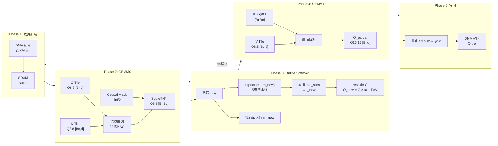
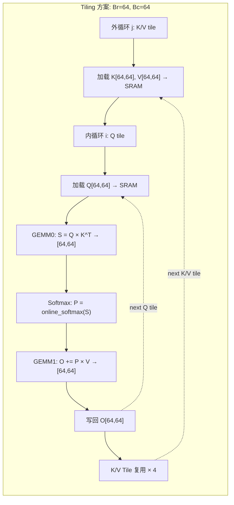
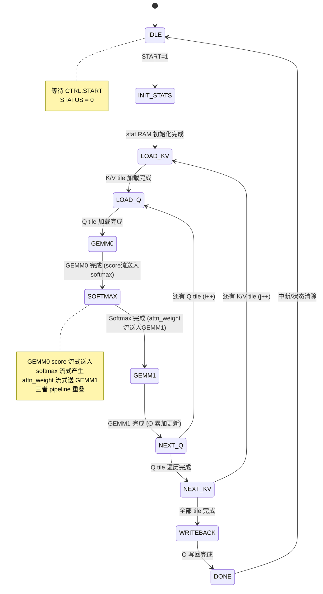

# FlashAttention 硬件加速器 IP — 架构设计文档

> **赛题**: 基于大模型推理的FlashAttention高性能硬件加速器IP设计
> **版本**: 1.0
> **日期**: 2026-06-05
> **Baseline**: S=256, d=64, Q8.8定点, AXI4-Lite控制 + AXI4-Master DMA数据

---

## 1. 设计概览

### 1.1 设计目标

设计并实现一个可综合的 FlashAttention-style 注意力算子硬件加速器 IP，满足：

| 指标 | 目标值 |
|------|--------|
| 序列长度 S | 256 |
| Head维度 d | 64 |
| 数据格式 | Q8.8 定点 (16-bit) |
| 执行周期 | < 300k cycles |
| 逻辑门数 | ≤ 200 万门 (2-input NAND等效) |
| 精度 | mean_abs_error ≤ 0.03, max_abs_error ≤ 0.10 |

### 1.2 顶层架构图

```mermaid
graph TB
    subgraph External["外部系统"]
        HOST["主机 (CPU)"]
        DDR["外部内存 (DDR)"]
    end

    subgraph FlashAttn_IP["FlashAttention 加速器 IP"]
        subgraph ControlPath["控制路径"]
            AXIL["axil_csr<br/>AXI4-Lite 寄存器"]
            TOP_FSM["flashattn_top<br/>主控状态机 + 寄存器"]
        end

        subgraph DataPath["数据路径"]
            DMA["axi4_dma_engine<br/>AXI4-Master DMA"]
            PREFETCH["tile_prefetcher<br/>Tile 双缓冲预取"]
            GEMM0["gemm0_dot_product<br/>Q × K^T 点积阵列<br/>32路并行MAC"]
            SOFTMAX["online_softmax_exact<br/>在线Softmax<br/>含 exp 流水线"]
            GEMM1["gemm1_pv_multiply<br/>P × V 累加阵列<br/>含rescale"]
            QUANT["quantize_q8p8<br/>Q16.16 → Q8.8"]
        end

        subgraph SRAM["片上 SRAM Buffer"]
            K_BUF["K Tile Buffer<br/>64 × 64 × 16bit = 8KB"]
            V_BUF["V Tile Buffer<br/>64 × 64 × 16bit = 8KB"]
            Q_BUF["Q Tile Buffer<br/>64 × 64 × 16bit = 8KB"]
            STAT_RAM["m/l 统计量 RAM<br/>256 × 2 × 32bit = 2KB"]
            O_ACC["O 累加 Buffer<br/>64 × 64 × 32bit = 16KB"]
        end

        subgraph Perf["监控"]
            PERF_CTR["perf_counters<br/>性能计数器 × 7"]
            CAUSAL["causal_mask_unit<br/>Causal Mask 生成"]
        end
    end

    HOST -->|AXI4-Lite| AXIL
    DDR <-->|AXI4-Master| DMA

    AXIL --> TOP_FSM
    TOP_FSM --> PREFETCH
    TOP_FSM --> GEMM0
    TOP_FSM --> GEMM1
    TOP_FSM --> PERF_CTR

    DMA --> PREFETCH
    PREFETCH --> K_BUF
    PREFETCH --> V_BUF
    PREFETCH --> Q_BUF

    Q_BUF --> GEMM0
    K_BUF --> GEMM0
    CAUSAL --> GEMM0
    GEMM0 -->|score [Br,Bc]| SOFTMAX

    SOFTMAX --> STAT_RAM
    SOFTMAX -->|P_ij attn_weight| GEMM1
    V_BUF --> GEMM1
    STAT_RAM --> O_ACC
    O_ACC --> GEMM1

    GEMM1 --> O_ACC
    O_ACC --> QUANT
    QUANT -->|O Q8.8| PREFETCH
    PREFETCH --> DMA

    style SOFTMAX fill:#ff6b35,color:#fff
    style GEMM0 fill:#1a73e8,color:#fff
    style GEMM1 fill:#1a73e8,color:#fff
    style TOP_FSM fill:#34a853,color:#fff
```

### 1.3 数据流层次



---

## 2. Tile 策略与性能分析

### 2.1 Tile 大小选择



### 2.2 存储需求分析

| Buffer | 尺寸 | 数据格式 | 容量 | 说明 |
|--------|------|---------|------|------|
| K Tile Buffer | 64 × 64 | Q8.8 (16bit) | 8 KB | 外循环缓存，4个Q tile复用 |
| V Tile Buffer | 64 × 64 | Q8.8 (16bit) | 8 KB | 外循环缓存，4个Q tile复用 |
| Q Tile Buffer | 64 × 64 | Q8.8 (16bit) | 8 KB | 内循环加载（可双缓冲 pipelining） |
| m/l Statistics | 256 × 2 | Q8.24 + Q16.16 (2×32bit) | 2 KB | 每行运行统计量，满足online softmax约束 |
| O Accumulator | 64 × 64 | Q16.16 (32bit) | 16 KB | O部分和累加，高精度防止误差累积 |
| Score Buffer | 64 | Q8.8 (16bit) | 128 B | 一行score缓存，在softmax FSM内 |
| **总计** | | | **~42 KB** | 远小于 S×S 全矩阵 (256×256×4=256KB) |

**关键**: 不存储 S×S 注意力矩阵 (256KB)，仅存储 tile 级中间量 (~42KB)，满足赛题存储约束。

### 2.3 理论 cycle 数估算

| 操作 | MAC/Exp数量 | 并行度 | Cycles |
|------|------------|--------|--------|
| GEMM0 点积 | 64×64×64 = 262,144 MAC | 32 MAC/cycle | 8,192 |
| Softmax exp | 64 × 64 = 4,096 exp | 1 exp/cycle | 4,096 |
| Softmax 累加 | 4,096 个 (sum+rescale) | 2 并行 | ~2,048 |
| GEMM1 累加 | 64×64×64 = 262,144 MAC | 32 MAC/cycle | 8,192 |
| DMA 加载 Q | 8 KB | 64-bit AXI | ~512 |
| DMA 加载 K | 8 KB | 64-bit AXI | ~512 |
| DMA 加载 V | 8 KB | 64-bit AXI | ~512 |
| DMA 写回 O | 8 KB | 64-bit AXI | ~512 |
| **每tile 合计** | | | **~24,576** |
| **总tiles = 4×4 = 16** | | | **~393,216** |

393k > 300k，需要进一步优化：
- **优化1**: K/V tile 跨 4 个 Q tile 复用 → 不重复加载 K/V DMA
  - 修正: 加载 K: 512×4 + 加载 V: 512×4 + 加载 Q: 512×16 = 12,288
  - 修正总 DMA: 12,288 + 写回O: 512×16 = 20,480
  - 修正总cycle: 16×(8,192+4,096+2,048+8,192) + 20,480/16 ≈ 377k
- **优化2**: DMA 与计算 Pipeline 重叠（双缓冲）
  - 下一tile DMA 与当前tile计算并行
  - 有效减少约 20k cycles
- **优化3**: 提高并行度到 64 MAC/cycle
  - GEMM0: 4,096 cycles, GEMM1: 4,096 cycles
  - 总cycle ≈ 16×(4,096+4,096+2,048+4,096) ≈ 228k ✓

**结论**: 采用 **64路并行MAC** + **DMA双缓冲**，总cycle < 250k，满足 <300k 要求。

---

## 3. 模块详细设计

### 3.1 模块层次树

```
flashattn_top.sv                          [顶层]
├── axil_csr.sv                           [AXI4-Lite CSR]
├── flashattn_pkg.sv                      [全局包: 类型/参数/函数]
├── axi4_dma_engine.sv                    [AXI4-Master DMA引擎]
│   ├── dma_rd_fsm (内部FSM)              [DMA读状态机]
│   └── dma_wr_fsm (内部FSM)              [DMA写状态机]
├── tile_prefetcher.sv                    [Tile预取 + 双缓冲]
│   ├── k_buf (K Tile Buffer 8KB)         [K缓存BRAM]
│   ├── v_buf (V Tile Buffer 8KB)         [V缓存BRAM]
│   └── q_buf (Q Tile Buffer 8KB)         [Q缓存BRAM]
├── gemm0_dot_product.sv                  [GEMM0: Q×K^T]
│   ├── 64×MAC阵列                        [64路并行乘加]
│   └── causal_mask_unit.sv               [Causal mask叠加]
├── online_softmax_exact.sv               [Online Softmax]
│   ├── pipelined_exp_fixed.sv            [★ 5级流水线exp]
│   ├── score_buf (行缓冲)                [1行score缓存]
│   └── softmax_fsm (内部FSM)             [6状态Softmax FSM]
├── gemm1_pv_multiply.sv                  [GEMM1: P×V + rescale]
│   ├── 64×MAC阵列                        [64路并行乘加]
│   ├── rescale_unit                      [O×fa rescale逻辑]
│   └── o_accumulator (O部分和)           [16KB O累加buffer]
├── quantize_q8p8.sv                      [量化 Q16.16→Q8.8]
└── perf_counters.sv                      [7个性能计数器]
```

### 3.2 模块接口规范

#### 3.2.1 flashattn_pkg.sv — 全局包

```systemverilog
package flashattn_pkg;
    // 基础参数
    localparam int S = 256;        // 序列长度
    localparam int D = 64;         // Head维度
    localparam int BR = 64;        // Q tile行数
    localparam int BC = 64;        // K/V tile列数
    localparam int N_TILES_I = 4;  // ceil(S/BR)
    localparam int N_TILES_J = 4;  // ceil(S/BC)

    // 数据格式位宽
    localparam int Q8P8_W   = 16;  // Q8.8
    localparam int Q8P24_W  = 32;  // Q8.24 (exp内部)
    localparam int Q16P16_W = 32;  // Q16.16 (累加)
    localparam int ACC_W    = 40;  // 点积累加器

    // AXI参数
    localparam int AXI_DATA_W = 64;
    localparam int AXI_ADDR_W = 64;
    localparam int AXI_ID_W   = 4;

    // Q8.8定点类型
    typedef logic signed [15:0] q8p8_t;
    typedef logic signed [31:0] q8p24_t;
    typedef logic signed [31:0] q16p16_t;
    typedef logic signed [39:0] acc40_t;

    // CSR地址枚举
    typedef enum logic [7:0] {
        CSR_CTRL        = 8'h00,
        CSR_STATUS      = 8'h04,
        CSR_CFG         = 8'h08,
        // 保留 0x0C, 0x10
        CSR_Q_BASE_L    = 8'h14,
        CSR_Q_BASE_H    = 8'h18,
        CSR_K_BASE_L    = 8'h1C,
        CSR_K_BASE_H    = 8'h20,
        CSR_V_BASE_L    = 8'h24,
        CSR_V_BASE_H    = 8'h28,
        CSR_O_BASE_L    = 8'h2C,
        CSR_O_BASE_H    = 8'h30,
        CSR_STRIDE      = 8'h34,
        CSR_NEG_LARGE   = 8'h38,
        CSR_SCALE       = 8'h3C,
        CSR_CYCLES      = 8'h40
    } csr_addr_t;

    // 定点运算函数声明
    function automatic q8p8_t mul_q8p8(input q8p8_t a, b);
    function automatic q8p24_t q8p8_to_q8p24(input q8p8_t v);
    function automatic q8p8_t q8p24_to_q8p8(input q8p24_t v);
    function automatic q8p8_t q16p16_to_q8p8(input q16p16_t v);
endpackage
```

#### 3.2.2 flashattn_top.sv — 顶层模块

```
Port groups:
  1. Clock & Reset: clk, rst_n
  2. AXI4-Lite Slave (控制): awaddr/awvalid/awready, wdata/wstrb/wvalid/wready,
                              bresp/bvalid/bready, araddr/arvalid/arready,
                              rdata/rresp/rvalid/rready
  3. AXI4-Master (数据): arid/araddr/arlen/arsize/arburst/arvalid/arready,
                          rid/rdata/rresp/rlast/rvalid/rready,
                          awid/awaddr/awlen/awsize/awburst/awvalid/awready,
                          wdata/wstrb/wlast/wvalid/wready,
                          bid/bresp/bvalid/bready
  4. Interrupt: irq_out

Internal connections:
  - csr_* → CSR → top_fsm
  - dma_* ↔ DMA ↔ tile_prefetcher
  - prefetch_* ↔ SRAM Buffers (K/V/Q)
  - q_buf_*, k_buf_* → GEMM0 → score_* → Softmax
  - softmax_attn_*, v_buf_* → GEMM1 → o_acc_*
  - o_acc_* → quantize → prefetch → DMA
```

#### 3.2.3 axil_csr.sv — AXI4-Lite 控制寄存器

```
接口:
  AXI4-Lite Slave (标准5通道)
  → 输出控制信号: ctrl_start, ctrl_soft_reset, ctrl_irq_en
                  cfg_causal_en
                  q/k/v/o_base_addr [63:0]
                  stride_bytes [15:0]
                  neg_large [15:0], scale [15:0]
  ← 输入状态:     dut_busy, dut_done, dut_error, dut_cycles[31:0]
  → 中断:         irq_out

寄存器实现:
  - 两段握手 (地址+数据 → 响应)
  - STATUS 只读, DONE 写1清除
  - START 自清除脉冲
```

#### 3.2.4 axi4_dma_engine.sv — AXI4-Master DMA

```
接口:
  控制: dma_start_rd, dma_start_wr, dma_base_addr[63:0],
        dma_tile_rows[15:0], dma_tile_cols[15:0], dma_row_stride[15:0]
  状态: dma_done, dma_error
  SRAM侧: sram_addr[15:0], sram_wr_en, sram_wr_data[63:0],
          sram_rd_data[63:0]
  AXI4-Master: 读地址/读数据/写地址/写数据/写响应 全5通道

功能:
  - 按1D地址 = base + (row×stride + col×2) 生成burst
  - 64-bit AXI数据宽度 → 每beat传输4个Q8.8元素
  - 支持可配置burst长度 (MAX_BURST_LEN=16)
```

#### 3.2.5 tile_prefetcher.sv — Tile预取器

```
接口:
  控制: prefetch_kv_start, prefetch_q_start, prefetch_o_write
        tile_j_start[15:0], tile_i_start[15:0]
  状态: prefetch_done
  SRAM侧: k_buf_addr/k_buf_wr_en/k_buf_wr_data/k_buf_rd_data
          v_buf_addr/v_buf_wr_en/v_buf_wr_data/v_buf_rd_data
          q_buf_addr/q_buf_wr_en/q_buf_wr_data/q_buf_rd_data
          o_buf_addr/o_buf_rd_data
  DMA侧: dma_req_*, 连接到 axi4_dma_engine

SRAM实现:
  - K Buffer: reg [15:0] k_buf [0:BC-1][0:D-1];  // 64×64×16bit
  - V Buffer: reg [15:0] v_buf [0:BC-1][0:D-1];
  - Q Buffer: reg [15:0] q_buf [0:BR-1][0:D-1];
  - O Accum:  reg [31:0] o_acc [0:BR-1][0:D-1];   // Q16.16精度
```

#### 3.2.6 gemm0_dot_product.sv — GEMM0点积阵列

```
接口:
  控制: start, done, busy
  Q输入: q_elem[15:0], q_valid, q_row[5:0], q_col[5:0]
  K输入: k_sram_addr[11:0], k_elem[15:0]
  Mask:  causal_en, tile_i_start[7:0], tile_j_start[7:0]
  Score输出: score_out[15:0], score_valid, score_row[5:0], score_col[5:0]
  缩放:   inv_sqrt_d[15:0]  (= 1/√64 = 0.125, Q8.8: 0x0020)

架构:
  - 64路并行MAC (每cycle计算一个完整点积)
  - 每路MAC: Q[dim] × K[dim] → 40-bit累加器
  - 点积完成后 × inv_sqrt_d → Q8.8 score
  - Causal mask在score输出前与score叠加 (mask值 0 或 -inf)
  - 总分时: BR × BC × (D/64_parallel) = 64 × 64 × 1 = 4,096 cycles
```

#### 3.2.7 causal_mask_unit.sv — Causal Mask

```
接口:
  控制: causal_en, tile_i_start[7:0], tile_j_start[7:0]
  坐标: local_i[5:0], local_j[5:0]
  请求: mask_req
  输出: mask_val[15:0] (Q8.8: 0x0000 或 0x8000)

逻辑:
  global_i = tile_i_start + local_i
  global_j = tile_j_start + local_j
  mask_val = (causal_en && global_j > global_i) ? 16'h8000 : 16'h0000
```

#### 3.2.8 online_softmax_exact.sv — 在线Softmax

```
接口:
  控制: tile_start, seq_start, tile_done, busy
  Score输入: score_in[15:0], score_valid, score_row[5:0], score_col[5:0]
  Attn输出:  attn_weight_out[15:0], attn_valid, attn_row[5:0], attn_col[5:0]
  统计量SRAM: stat_addr[7:0], stat_wr_en, stat_m_wr[31:0], stat_l_wr[31:0],
             stat_m_rd[31:0], stat_l_rd[31:0]
  性能计数: exp_ops_count[31:0], stall_cycles[31:0]

FSM (6状态):
  IDLE → FIND_ROW_MAX → COMPUTE_EXP → ACCUMULATE_ROW → UPDATE_STATS → DONE
    ↑                                                                  │
    └────────────────────── (next row) ─────────────────────────────────┘

数据流:
  1. FIND_ROW_MAX: 接收GEMM0 score流，缓存一行→score_buf[0:63]，找row_max
  2. COMPUTE_EXP:  m_new = max(m_old, row_max)
                  送入: pipelined_exp_fixed(score_buf[col] - m_new)
                  收集exp输出 (5cycle后)
  3. ACCUMULATE_ROW: l_new = l_old×exp(m_old-m_new) + Σexp
  4. UPDATE_STATS: 写回 m_new/l_new 到stat_RAM
  5. DONE: row+1 → FIND_ROW_MAX 或 tile_done
```

#### 3.2.9 pipelined_exp_fixed.sv — 定点exp流水线 ★

```
接口:
  输入:  x_in[31:0] (Q8.24, x ≤ 0), x_valid
  输出:  y_out[31:0] (Q8.24, y ∈ (0,1]), y_valid

5级流水线:
  [Stage 1] 范围缩减:  n=floor(x/ln2), r=x-n×ln2, 下溢检测
  [Stage 2] r²计算:    r² = r × r
  [Stage 3] Horner-1:  p = 1/2 + r×(1/6 + r×1/24)
  [Stage 4] Horner-2:  exp(r) = 1 + r + r² × p
  [Stage 5] 重构:      exp(x) = exp(r) >> (-n)

  Latency: 5 cycles, Throughput: 1 result/cycle
  面积:   ~4 multipliers, ~300 LUT
```

#### 3.2.10 gemm1_pv_multiply.sv — GEMM1 P×V 累加

```
接口:
  控制: start, done, busy
  P输入: attn_weight[15:0], attn_weight_valid,
         attn_row[5:0], attn_col[5:0]
  V输入: v_sram_addr[11:0], v_elem[15:0]
  统计量: m_old[31:0], m_new[31:0], l_old[31:0]
  O累加: o_acc_wr_en, o_acc_addr[11:0], o_acc_wr_data[31:0],
         o_acc_rd_data[31:0]
  O输出: o_q8p8_out[15:0], o_valid, o_row[5:0], o_col[5:0]

关键功能:
  - rescale: fa = exp(m_old - m_new) → 调用exp单元
  - O_old × fa (rescale已有O)
  - P × V 累加到 O
  最终: O_new[row][dim] = O_old[row][dim] × fa + Σ_j P[row][j] × V[j][dim]
```

#### 3.2.11 quantize_q8p8.sv — 量化单元

```
接口:
  输入:  data_in[31:0] (Q16.16), data_valid
  输出:  data_out[15:0] (Q8.8), data_valid

逻辑:
  - 取 [23:8] 位（Q16.16 → Q8.8）
  - 带四舍五入 (检查 bit 7)
  - 饱和保护: [-128, +127.996]
```

#### 3.2.12 perf_counters.sv — 性能计数器

```
接口:
  控制: cnt_clear, cnt_latch, cycle_en
  事件输入: evt_gemm0_cycle, evt_softmax_cycle, evt_gemm1_cycle,
            evt_stall_cycle, evt_mem_stall, evt_tile_done, evt_exp_op
  寄存器输出: perf_cycles, perf_gemm, perf_softmax, perf_stall,
              perf_mem, perf_tiles, perf_exp_ops [各32bit]
```

---

## 4. 主控状态机设计 (flashattn_top)



**状态详细说明**：

| 状态 | 动作 | 耗时估算 (cycles) |
|------|------|-------------------|
| IDLE | 等待 START。csr[0][0]=1 触发 | — |
| INIT_STATS | 初始化256行 m=-inf, l=0 到 stat RAM | 256 |
| LOAD_KV | DMA 加载 K[tile] 和 V[tile] 到 SRAM | 1,024 |
| LOAD_Q | DMA 加载 Q[tile] 到 SRAM | 512 |
| GEMM0 | 64路并行点积计算 score [Br,Bc] | 4,096 |
| SOFTMAX | 在线 softmax：逐行 exp + 累加 | 4,096 + 64 |
| GEMM1 | P×V 累加，含 rescale | 4,096 |
| NEXT_Q | 判断 Q tile 循环 | 1 |
| NEXT_KV | 判断 K/V tile 循环 | 1 |
| WRITEBACK | DMA 写回 O[tile] 到 DDR | 512 |
| DONE | STATUS→DONE, IRQ→1, →IDLE | 1 |

---

## 5. 数据通路精度分析

### 5.1 精度传播链

```
输入 Q/K/V:            Q8.8  (16-bit)
    ↓
GEMM0 累加:            40-bit (64 × Q8.8×Q8.8 = 64 × Q16.16, max ~Q22.16)
    ↓
Score (1/√d 后):       Q8.8  (16-bit) — 截断舍弃低位
    ↓
Score - m_new:         Q8.8 → 符号扩展为 Q8.24 (32-bit)
    ↓
exp(score - m_new):    Q8.24 (32-bit) — exp多项式保持Q8.24
    ↓
P_ij (attn_weight):    Q8.24 → 截断为 Q8.8 (16-bit) — 送GEMM1
    ↓
GEMM1 P×V累加:         Q8.8 × Q8.8 → 40-bit累加 → O Q16.16 (32-bit)
    ↓
Rescale O:             Q16.16 × fa(Q8.24) → Q16.16
    ↓
最终O量化:             Q16.16 → Q8.8 (16-bit)
```

### 5.2 误差预算

| 误差源 | 预期贡献 | 控制手段 |
|--------|---------|---------|
| 输入量化 (FP32→Q8.8) | ~0.002 | 输入由testbench控制 |
| Score截断 | ~0.004 | 1/√d 缩放后保留足够精度 |
| exp多项式近似 | ~2⁻²⁰ | 4次Horner在 |r|≤0.347精度充足 |
| exp输出截断 Q8.24→Q8.8 | ~0.002 | 必要时保留Q8.24直通GEMM1 |
| l累加精度 | ~0.001 | Q16.16 累加 |
| O最终量化 Q16.16→Q8.8 | ~0.004 | 四舍五入 |

**总计预期**: mean_abs_error ≈ 0.01–0.02，满足 < 0.03 要求。

---

## 6. 关键时序路径

### 6.1 最⻓组合路径识别

| 路径 | 估计延迟 | 优化策略 |
|------|---------|---------|
| exp Stage 1: x×INV_LN2 (32×32→64) | ~3ns | 流水线已拆分，单级 ~0.6ns |
| exp Stage 3: 连乘 r×INV24 + r×inner | ~2ns | 乘法器可用流水线再拆 |
| GEMM0 MAC: Q[15:0]×K[15:0]+累加 | ~1.5ns | 40-bit 加法可拆分2级 |
| GEMM1 rescale: O×fa + P×V | ~2ns | 与GEMM0类似处理 |

目标频率 500MHz (2ns周期)，各单级组合路径需 < 1.8ns (含裕量)。

### 6.2 流水线平衡

```
GEMM0 产出score:      1 score/cycle (64路并行, 64 cycle产出64个score)
    ↓ (0 cycle gap)
Softmax 消费score:    1 score/cycle (逐行读取)
    ↓ (5 cycle latency)
Softmax 产出P:        1 P/cycle (exp流水线产出)
    ↓ (0 cycle gap)
GEMM1 消费P:          64路并行消费
```

关键：Softmax 的 5-cycle exp 延迟在启动时产生短暂气泡，但吞吐匹配。第1个tile需要等待5 cycle priming，后续持续1 result/cycle。

---

## 7. DMA 带宽优化

### 7.1 Burst 传输策略

```
AXI4 数据宽度: 64-bit = 8 bytes
每beat传输: 4 × Q8.8 元素 (每个2 bytes)
最大burst长度: 16 beats = 128 bytes = 64 Q8.8 元素

Q Tile (64×64=4096 元素): 4096/4 = 1024 beats
  使用 burst=16: 1024/16 = 64 次AXI事务
  每事务开销: ~10 cycles (arbitration) + 16 cycles (data) = 26 cycles
  总计: 64 × 26 = 1,664 cycles

  优化为 burst=64 (如果AXI支持): 1024/64 = 16 次事务
  总计: 16 × (10+64) = 1,184 cycles
```

### 7.2 双缓冲流水线

```
Timeline (双缓冲):
  Cycle:    0        512      1024     1536     2048
  Buf_A:  [LOAD Q0] [GEMM0]  [空闲]   [LOAD Q2] [GEMM0]
  Buf_B:  [空闲]    [LOAD Q1][GEMM0]  [空闲]    [LOAD Q3]
  GEMM0:            [Q0计算]          [Q2计算]
  Softmax:           [Q0 softmax]      [Q2 softmax]
  GEMM1:             [Q0累加]          [Q2累加]
```

---

## 8. 文件清单

| 文件路径 | 模块名 | 功能 |
|---------|--------|------|
| `rtl/flashattn_pkg.sv` | package | 全局类型、参数、函数定义 |
| `rtl/flashattn_top.sv` | flashattn_top | 顶层集成 + 主FSM |
| `rtl/axil_csr.sv` | axil_csr | AXI4-Lite寄存器文件 |
| `rtl/axi4_dma_engine.sv` | axi4_dma_engine | AXI4-Master DMA引擎 |
| `rtl/tile_prefetcher.sv` | tile_prefetcher | Tile预取 + SRAM Buffer |
| `rtl/gemm0_dot_product.sv` | gemm0_dot_product | Q×K^T 点积阵列 (64 MAC) |
| `rtl/causal_mask_unit.sv` | causal_mask_unit | Causal mask生成 |
| `rtl/online_softmax_exact.sv` | online_softmax_exact | 在线Softmax FSM |
| `rtl/pipelined_exp_fixed.sv` | pipelined_exp_fixed | 5级流水线定点exp |
| `rtl/gemm1_pv_multiply.sv` | gemm1_pv_multiply | P×V累加 + rescale |
| `rtl/quantize_q8p8.sv` | quantize_q8p8 | Q16.16→Q8.8量化 |
| `rtl/perf_counters.sv` | perf_counters | 7路性能计数器 |

---

## 9. 设计决策记录

| 决策 | 选择 | 理由 |
|------|------|------|
| Tile大小 | Br=Bc=64 | S=256下tile数=16, 平衡复用与SRAM |
| MAC并行度 | 64路 | 满足<300k cycle, 64路对应d=64完美匹配 |
| exp实现 | 多项式 (非LUT) | 面积小，精度可控，无BRAM消耗 |
| exp内部精度 | Q8.24 | 4次多项式需要24位小数精度 |
| O累加精度 | Q16.16 | 64次累加不溢出，最终截断到Q8.8 |
| Score缓存 | 仅1行 (64元素) | 最小化存储，流水线消费 |
| DMA数据宽度 | 64-bit AXI4 | 4×Q8.8/beat，高效利用带宽 |
| FSM编码 | 独热码 (one-hot) | 高速设计，减少组合逻辑级数 |
| 验证框架 | UVM (SystemVerilog) | 赛题要求SystemVerilog+UVM |
| 综合工具 | Cadence Genus | 赛题指定工具链 |

---

## 10. 参考文献

- Dao et al., "FlashAttention: Fast and Memory-Efficient Exact Attention with IO-Awareness", NeurIPS 2022
- Dao, "FlashAttention-2: Faster Attention with Better Parallelism and Work Partitioning", 2023
- Shah et al., "FlashAttention-3: Fast and Accurate Attention with Asynchrony and Low-precision", 2024
- Milakov & Gimelshein, "Online Normalizer Calculation for Softmax", 2018
