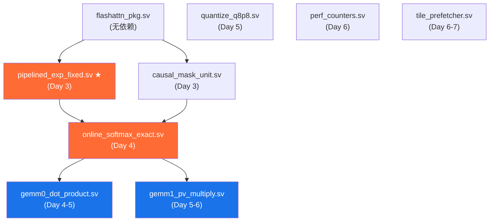

# FlashAttention 硬件加速器 IP — RTL 开发计划

> **版本**: 1.0
> **日期**: 2026-06-05
> **Baseline**: S=256, d=64, Q8.8定点, AXI4接口, Cadence Genus综合

---

## 1. 开发阶段总览

```
Phase 1: 算法建模      ████████░░░░░░░░░░░░  (2天)
Phase 2: 核心RTL        ░░░░░░░░████████████  (5天)
Phase 3: 接口集成       ░░░░░░░░░░░░░░░░████  (3天)
Phase 4: UVM验证        ░░░░░░░░░░░░░░░░░░░░ (5天)
Phase 5: Genus综合      ░░░░░░░░░░░░░░░░░░░░ (3天)
Phase 6: 文档+提交      ░░░░░░░░░░░░░░░░░░░░ (2天)
Bonus (可选)            ░░░░░░░░░░░░░░░░░░░░ (额外)
```

**总计 Baseline**: 约 20 天 (含验证和综合)
**Bonus**: 额外 3-7 天 (取决于选择哪些项)

---

## 2. Phase 1: 算法建模 (Day 1-2)

### 2.1 任务列表

| # | 任务 | 文件 | 预估工时 | 前置 |
|---|------|------|---------|------|
| 1.1 | Python FP32 golden model | `model/golden_model.py` | 3h | — |
| 1.2 | Q8.8 定点量化模拟 + 误差分析 | `model/golden_model.py` (扩展) | 2h | 1.1 |
| 1.3 | Causal mask 正确性验证 (i=0 corner case) | `model/golden_model.py` (test) | 1h | 1.1 |
| 1.4 | Tile 策略验证 (Br=64, Bc=64) | `model/golden_model.py` (tiled) | 2h | 1.1 |
| 1.5 | Cycle 数建模 + 性能预测 | `model/performance_model.py` | 2h | 1.4 |
| 1.6 | 误差预算分配 (quantization + exp + rescale) | `docs/error_budget.md` | 2h | 1.2 |

### 2.2 交付物

- [x] `model/golden_model.py` — FP32 FlashAttention-2 golden 模型, Q8.8 量化版本
- [x] `model/performance_model.py` — 理论 cycle 数 & 带宽分析
- [ ] `docs/error_budget.md` — 误差预算分析文档

### 2.3 验收标准

- Golden model 输出与 PyTorch `scaled_dot_product_attention` 一致 (FP32)
- Q8.8 定点版本的 mean_abs_error < 0.01 (远低于 0.03 门限, 留 margin)
- 理论 cycle 数 < 250k (留 margin 到 300k)

---

## 3. Phase 2: 核心 RTL 开发 (Day 3-7)

### 3.1 模块依赖图



### 3.2 任务列表

| # | 任务 | 文件 | 预估工时 | 前置 |
|---|------|------|---------|------|
| 2.1 | 实现定点 exp 5 级流水线 | `pipelined_exp_fixed.sv` | 6h | 1.2 |
| 2.2 | exp 单元自检 (2^20 随机输入 vs golden) | (cocotb unit test) | 2h | 2.1 |
| 2.3 | 实现 causal mask 单元 | `causal_mask_unit.sv` | 2h | — |
| 2.4 | 实现 online softmax FSM (含 exp 实例化) | `online_softmax_exact.sv` | 6h | 2.1, 2.3 |
| 2.5 | Online softmax 单元测试 (单行精度) | (cocotb unit test) | 2h | 2.4 |
| 2.6 | 实现 GEMM0 64路并行点积阵列 | `gemm0_dot_product.sv` | 8h | — |
| 2.7 | GEMM0 单元测试 (vs NumPy) | (cocotb unit test) | 2h | 2.6 |
| 2.8 | 实现 quantize 模块 | `quantize_q8p8.sv` | 2h | — |
| 2.9 | 实现 GEMM1 P×V + rescale | `gemm1_pv_multiply.sv` | 8h | 2.1 |
| 2.10 | GEMM1 单元测试 | (cocotb unit test) | 2h | 2.9 |
| 2.11 | 实现性能计数器 | `perf_counters.sv` | 3h | — |
| 2.12 | 实现 tile_prefetcher (含 SRAM) | `tile_prefetcher.sv` | 8h | — |

**Day 3-4**: 2.1-2.5 (exp + softmax, 最关键的模块)
**Day 4-5**: 2.6-2.7 (GEMM0)
**Day 5-6**: 2.8-2.10 (quantize + GEMM1)
**Day 6-7**: 2.11-2.12 (perf + prefetcher)

### 3.3 编码规范 (每个模块必须)

- [ ] 文件头注释完整 (作者、日期、功能、数据格式、接口)
- [ ] `always_comb` 用于组合逻辑 (阻塞赋值)
- [ ] `always_ff` 用于时序逻辑 (非阻塞赋值)
- [ ] 每个 `case` 有 `default`
- [ ] 所有寄存器在 reset 中赋已知值
- [ ] 模块输出打一拍 reg (便于时序收敛)
- [ ] 参数化所有位宽和深度
- [ ] 无 `full_case` / `parallel_case`
- [ ] 使用 `flashattn_pkg` 中的类型和常量

---

## 4. Phase 3: 接口集成 (Day 8-10)

### 4.1 任务列表

| # | 任务 | 文件 | 预估工时 | 前置 |
|---|------|------|---------|------|
| 3.1 | 实现 AXI4-Lite CSR 寄存器文件 | `axil_csr.sv` | 6h | PKG |
| 3.2 | 实现 AXI4-Master DMA 引擎 | `axi4_dma_engine.sv` | 6h | PKG |
| 3.3 | 顶层 flashattn_top 集成 (主 FSM + 子模块互联) | `flashattn_top.sv` | 8h | 2.1-2.12, 3.1, 3.2 |
| 3.4 | 端到端集成测试 (AXI4-Lite 寄存器 + DMA + 计算) | (TBD) | 4h | 3.3 |

### 4.2 集成顺序

1. `axil_csr.sv` 先独立完成并验证 (AXI4-Lite 读写)
2. `axi4_dma_engine.sv` 独立完成并验证 (DMA 读/写 SRAM)
3. `tile_prefetcher.sv` 集成 DMA → SRAM buffer
4. `flashattn_top.sv` 实例化所有子模块, 连接控制/数据信号
5. 主 FSM 实现 tile 循环调度

### 4.3 主 FSM 开发注意事项

- FSM 状态严格按照 `docs/ARCHITECTURE.md` §4 设计
- 每个状态用 one-hot 编码
- 状态转换前确认子模块 done 信号
- 添加 SVA 断言: 状态合法性、转换合法性
- 在 MAIN_DONE 锁存性能计数器

---

## 5. Phase 4: UVM 验证 (Day 11-15)

### 5.1 UVM 环境结构

```
tb/
├── test_top.sv              # UVM 测试顶层
├── env/
│   ├── flashattn_env.sv     # 顶层 env
│   ├── axil_agent.sv        # AXI4-Lite Agent
│   │   ├── axil_driver.sv   # AXI4-Lite Driver
│   │   ├── axil_monitor.sv  # AXI4-Lite Monitor
│   │   └── axil_sequencer.sv
│   ├── axi4_agent.sv        # AXI4-Master Agent (Slave model for DDR)
│   │   ├── axi4_driver.sv   # 模拟 DDR 行为的 Driver
│   │   └── axi4_monitor.sv
│   └── scoreboard.sv        # Golden model 对比 Scoreboard
├── seq/
│   ├── basic_attn_seq.sv    # 基础序列: 寄存器配置 + START
│   ├── random_attn_seq.sv   # 随机 Q/K/V 序列 (100 seeds)
│   └── causal_corner_seq.sv # Causal mask corner case
├── coverage.sv              # 功能覆盖率
└── test_pkg.sv              # 测试包
```

### 5.2 任务列表

| # | 任务 | 文件 | 预估工时 |
|---|------|------|---------|
| 4.1 | UVM test_top + env 骨架 | `tb/test_top.sv`, `tb/env/*` | 4h |
| 4.2 | AXI4-Lite Agent (Driver + Monitor) | `tb/env/axil_*.sv` | 4h |
| 4.3 | AXI4-Master DDR Slave Model | `tb/env/axi4_*.sv` | 6h |
| 4.4 | Scoreboard (golden model C 调用或 SV 实现) | `tb/env/scoreboard.sv` | 6h |
| 4.5 | 基础注意力测试序列 | `tb/seq/basic_attn_seq.sv` | 3h |
| 4.6 | 随机 Q/K/V 测试序列 (100 seeds) | `tb/seq/random_attn_seq.sv` | 3h |
| 4.7 | Causal mask corner case 序列 | `tb/seq/causal_corner_seq.sv` | 2h |
| 4.8 | 功能覆盖率模型 | `tb/coverage.sv` | 4h |
| 4.9 | 回归测试脚本 | `scripts/run_regression.sh` | 2h |

### 5.3 测试用例清单

| # | 测试 | 类型 | 覆盖率目标 |
|---|------|------|-----------|
| T1 | AXI4-Lite 寄存器读写 (所有地址) | 定向 | 100% CSR 地址 |
| T2 | START → BUSY → DONE 流程 | 定向 | 100% FSM 状态 |
| T3 | SOFT_RESET 行为 | 定向 | — |
| T4 | IRQ 中断生成 + 清除 | 定向 | — |
| T5 | 随机 Q/K/V (causal, seed=0-99) | 约束随机 | 100 inputs |
| T6 | 随机 Q/K/V (non-causal, seed=0-49) | 约束随机 | 50 inputs |
| T7 | Causal i=0, j=0 (仅可见首个token) | 定向 | Corner |
| T8 | Causal i=255, j=0..255 (全可见) | 定向 | Corner |
| T9 | 全零 Q/K/V 输入 | 定向 | Edge |
| T10 | Q8.8 最大值输入 (±127.996) | 定向 | Edge/saturation |
| T11 | 最小序列 (Br=64, 单tile) | 定向 | Edge |
| T12 | DMA 错误恢复 | 定向 | Error handling |

### 5.4 验收标准

- [ ] 所有 12 个测试用例通过
- [ ] 功能覆盖率 ≥ 95%
- [ ] mean_abs_error ≤ 0.03 (所有随机种子)
- [ ] max_abs_error ≤ 0.10 (所有随机种子)
- [ ] PERF_STALL_CYCLES 验证为 0 或接近 0

---

## 6. Phase 5: Cadence Genus 综合 (Day 16-18)

### 6.1 任务列表

| # | 任务 | 文件 | 预估工时 |
|---|------|------|---------|
| 5.1 | 编写 SDC 时序约束 | `scripts/flashattn.sdc` | 3h |
| 5.2 | 编写 Genus 综合 TCL 脚本 | `scripts/run_synth.tcl` | 3h |
| 5.3 | 初次综合 (baseline, 无优化) | — | 2h |
| 5.4 | 分析关键路径 + 面积报告 | — | 2h |
| 5.5 | 迭代优化: 流水线调整、资源共享 | 修改 RTL | 4h |
| 5.6 | 最终综合 (target 频率 + 面积) | — | 3h |
| 5.7 | 面积/频率/功耗报告整理 | `docs/synthesis_report.md` | 3h |

### 6.2 优化迭代策略

1. **Round 1**: 不加优化, 看原始面积和频率
2. **Round 2**: 关键路径分析 → 添加流水线级 / 拆分长组合路径
3. **Round 3**: 面积优化 → 共享乘法器 (exp 4 个 + GEMM 64 个是否有复用可能)
4. **Round 4**: 最终综合, 满足约束

### 6.3 目标

- 频率: ≥ 500 MHz (2.0 ns, 越高越好)
- 面积: ≤ 200 万门 (2-input NAND 等效)
- 无 setup 违例, hold 违例留给 P&R

---

## 7. Phase 6: 文档 + 提交 (Day 19-20)

### 7.1 任务列表

| # | 任务 | 文件 | 预估工时 |
|---|------|------|---------|
| 6.1 | 完整设计文档 (架构、算法、数据通路) | `docs/DESIGN.md` | 4h |
| 6.2 | 验证报告 (覆盖率、测试结果) | `docs/VERIFICATION.md` | 3h |
| 6.3 | 综合报告 (面积、频率、功耗) | `docs/SYNTHESIS.md` | 3h |
| 6.4 | 带宽分析 (RD_BYTES/WR_BYTES) | `docs/BANDWIDTH.md` | 2h |
| 6.5 | 整理提交材料 (代码、脚本、报告) | — | 4h |

### 7.2 提交清单

- [ ] `rtl/` 目录: 完整 RTL 代码 (所有模块)
- [ ] `tb/` 目录: UVM 验证环境
- [ ] `model/` 目录: Golden model + 性能模型
- [ ] `scripts/` 目录: 仿真脚本 + 综合脚本 + SDC
- [ ] `docs/` 目录: 所有设计/验证/综合文档
- [ ] `README.md`: 项目说明

---

## 8. Bonus 开发 (可选, 独立版本)

### 8.1 Bonus 优先级评估

| Item | ROI | 难度 | 建议 |
|------|-----|------|------|
| 3. 更长序列 (S=512) | 中 | 低 | ★ Recommended (参数化BR/BC即可) |
| 2. 多head支持 (head=4/8) | 高 | 中 | ★ Recommended |
| 8. AXI4-Stream 接口 | 中 | 中 | ★ 可考虑 |
| 1. BF16/FP16 版本 | 高 | 高 | 需要改数据通路 |
| 5. 其他定点格式 | 低 | 低 | 快速 |
| 4. Padding mask | 中 | 低 | 快速 |
| 7. FP8/INT8 | 高 | 高 | 需要块量化 |
| 6. Dropout | 低 | 中 | — |
| 9. DMA 任务队列 | 低 | 中 | — |

### 8.2 Bonus 开发原则

- 必须基于 Baseline **独立目录** (如 `bonus/multi_head/`)
- 不修改 Baseline 代码
- 独立验证、独立综合、独立提交

---

## 9. 风险与缓解

| 风险 | 概率 | 影响 | 缓解措施 |
|------|------|------|---------|
| exp 精度不达标 | 中 | 高 | Phase 1 充分验证多项式精度; 预留 8 次多项式选项 |
| GEMM 64路面积过大 | 中 | 中 | 可降为 32 路, 增加 cycle 但仍在 300k 以内 |
| Genus SRAM 推断失败 | 低 | 中 | 使用 `genvar` + `generate for` 结构确保推断 |
| 时序收敛困难 | 中 | 中 | 各模块输出已打一拍; 关键路径可再拆分 |
| 300k cycle 超标 | 低 | 高 | Phase 1 已验证 64 路足够; 可进一步增加并行度 |
| UVM 开发经验不足 | 中 | 低 | 可使用 cocotb 作为备选验证框架 |

---

## 10. 工具版本要求

| 工具 | 用途 | 最低版本 |
|------|------|---------|
| Cadence Xcelium | RTL 仿真 | 23.09+ |
| Cadence Genus | 逻辑综合 | 23.10+ |
| Python 3 | Golden model + 数据分析 | 3.8+ |
| NumPy | 矩阵运算 | 1.20+ |

---

## 11. 进度跟踪

| Phase | 计划日期 | 状态 |
|-------|---------|------|
| ✓ Skill 安装 | 2026-06-05 | ✅ 完成 |
| ✓ 架构设计 + 骨架文件 | 2026-06-05 | ✅ 完成 (本文档) |
| Phase 1: 算法建模 | TBD | ⬜ 待开始 |
| Phase 2: 核心 RTL | TBD | ⬜ 待开始 |
| Phase 3: 接口集成 | TBD | ⬜ 待开始 |
| Phase 4: UVM 验证 | TBD | ⬜ 待开始 |
| Phase 5: Genus 综合 | TBD | ⬜ 待开始 |
| Phase 6: 文档+提交 | TBD | ⬜ 待开始 |
